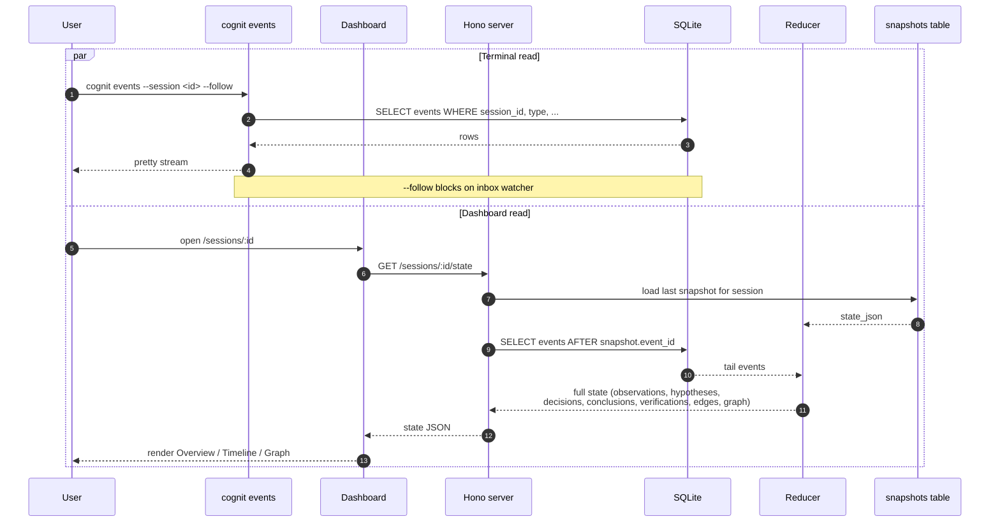
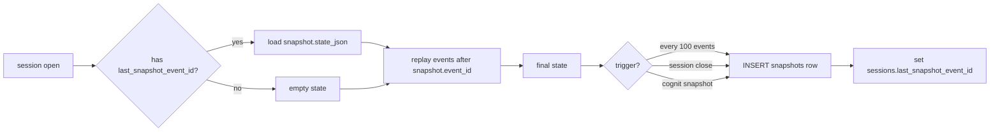
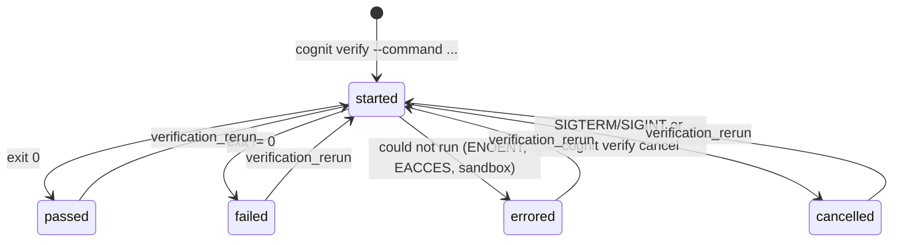

# Cognit Architecture

> Engineering view of the system. `README.md` is the pitch. `plan.xml` is the spec. This file is how the runtime fits together.

---

## Layers

Cognit is a TypeScript monorepo. Runtime is Node.js. Two top-level groups:

```txt
apps/                  # user-facing processes
  server/              # Hono HTTP API (v0.1+)
  dashboard/           # Vite + React UI (v0.1+)

packages/              # libraries, no process of their own
  core/                # domain types, Effect schemas, event defs, reducer, redaction
  db/                  # SQLite + Drizzle; implements the event store
  cli/                 # Commander.js; one binary: `cognit`
  sdk/                 # programmatic API for tools that prefer calls over inbox
  verification/        # subprocess lifecycle for `cognit verify`
```

Dependency direction is one-way. `apps/*` and `cli` import from `packages/*`. `packages/*` never import from `apps/*`. `core` has no I/O — it is pure logic, unit-testable in isolation.

```txt
apps/server   ─┐
apps/dashboard┤
cli           ├──► core  ◄── db
sdk           ┤         ◄── verification
              ┘
```

---

## Module map

| Package        | Owns                                                     | Does not own                                 |
| -------------- | -------------------------------------------------------- | -------------------------------------------- |
| `core`         | Types, Effect schemas, reducer, redaction patterns, DSLs | I/O, SQLite, HTTP, subprocess                |
| `db`           | Drizzle schema, migrations, `appendEvent` boundary       | UI, HTTP routes, business policy             |
| `cli`          | Commander command tree, stdout formatting                | Domain logic (delegates to `core` + `db`)    |
| `sdk`          | Typed calls into `db` for workers                        | File watching, subprocess                    |
| `verification` | Spawn, signal, timeout, stream stdout/stderr             | Decision policy, store writes                |
| `server`       | Hono routes, SSE stream, session-scoped reads            | Reducer internals (calls into `core`)        |
| `dashboard`    | React pages, React Flow graph layout                     | Data fetching policy beyond what API exposes |

---

## Data flow at a glance

```txt
              ┌──────────────────────────────────────────────┐
              │                .cognit/                       │
              │  cognit.db ◄── events (append-only)           │
              │  cognit.yaml (config)                        │
              │  inbox/ ◄── worker JSON events (atomic)      │
              │  snapshots/ ◄── state checkpoints            │
              │  artifacts/  ◄── sha256-addressed evidence   │
              │  archive/    ◄── gc'd artifacts               │
              └──────────────────────────────────────────────┘
                       ▲                       ▲
                       │ appendEvent           │ read
                       │                       │
       ┌───────────────┴────────┐    ┌──────────┴──────────┐
       │  write paths          │    │  read paths          │
       │  cli (direct)         │    │  cli `events` tail   │
       │  sdk (programmatic)   │    │  Hono API            │
       │  inbox watcher        │    │  reducer (replay)    │
       │  HTTP POST /events    │    │  snapshot + tail     │
       └───────────────────────┘    └──────────────────────┘
```

Workers are temporary. State is permanent. The store is the only place anything lives.

---

## Write paths — ingest pipeline

Every event enters the system through exactly one function: `appendEvent` in `packages/db`. This is the redaction boundary.

```mermaid
sequenceDiagram
    autonumber
    participant W as Worker
    participant FS as .cognit/inbox/
    participant Wt as Watcher (chokidar)
    participant A as appendEvent
    participant R as Redactor
    participant Z as Schema validator
    participant DB as SQLite events table
    participant AR as actors table

    W->>FS: write <id>.tmp
    Note over W,FS: fsync
    W->>FS: rename <id>.json (atomic)
    FS-->>Wt: chokidar event
    Wt->>Wt: debounce 200ms; reject if mtime too fresh
    Wt->>A: hand off raw JSON
    A->>R: scan payload_json
    R-->>A: redacted payload + redaction_applied audit
    A->>Z: validate by (type, version)
    Z-->>A: typed payload
    A->>AR: resolve actor (auto-register if unknown)
    AR-->>A: actor_id + trust_score
    A->>DB: INSERT events row
    Note over A,DB: every column set: id, project_id,<br/>session_id, actor_id, type, version,<br/>payload_json, source_json, artifact_refs_json,<br/>causation_id, correlation_id, confidence,<br/>parent_verification_id, created_at
```

The CLI direct-write path and the future `POST /events` HTTP path both go through the same `appendEvent`. Adding a new write path does not require touching redaction.

---

## appendEvent is the redaction boundary

> **Invariant:** secret patterns never reach the `events.payload_json` column. The only safe assumption for a new contributor is "appendEvent is the redaction boundary". The inbox watcher does not redact on its own; it just feeds untrusted bytes into appendEvent. Redaction runs inside appendEvent regardless of caller.

What appendEvent guarantees, in order:

1. JSON shape sanity.
2. Effect Schema validation against `(type, version)` schema in `core`.
3. Redaction of `payload_json` using built-in patterns (`jwt`, `api_key_inline`, `pem_block`, `password_field`) plus any `cognit.yaml` extras.
4. Append a `redaction_applied` event when a pattern fires (audit trail: pattern name + affected entity id, never the redacted content).
5. Resolve `actor` to `actor_id`; auto-register unknown actors with the default trust score from `cognit.yaml.actors.defaults.<type>`. **Do not allow trust_score=0 to persist on a registered actor** — the default is overwritten on first sighting.
6. Insert into `events`. There is no partial-write mode: either the whole event lands or it doesn't.

---

## Read path

Two consumers: the dashboard (and the Hono API) and the terminal `cognit events` command. Both serve the same data — the API is the canonical read surface; the CLI is its tail-style counterpart.



For live updates, the server exposes `GET /events/stream` over Server-Sent Events. New rows from `appendEvent` are pushed to subscribed clients. The dashboard's Timeline page subscribes; `cognit events --follow` is a thin SSE client.

---

## Reducer and snapshots

The reducer is a pure function: `events[] → state`. The store replays events to rebuild a session's state. Snapshots are an optimization, not a source of truth.



Snapshot trigger policy (configurable per project):

- Every N events (`snapshot_every_n_events`, default 100).
- On `session_closed`.
- Explicitly via `cognit snapshot`.

Snapshots are append-only. Replay from a snapshot is still possible from events alone if the snapshot is corrupted or lost. Snapshots never replace events.

**Auto-snapshot trigger**: every N events (default 100, configurable via `session.snapshot_every_n_events` in `cognit.yaml`). Triggered inline on `cognit append` / inbox processing. See `docs/phase-2.5-results.md`.

---

## Trust boundary

Every event row has `actor_id`. Identity is per-actor, not per-event — the future trust engine reasons about actors, not individual rows.

```txt
┌──────────────────────────────────────────────────────────────┐
│  Trust starts at the actor boundary.                         │
│                                                              │
│  Unknown actor seen ─► auto-register                         │
│                        ─► trust_score = cognit.yaml.actors   │
│                            .defaults.<type>                  │
│                        ─► emit actor_registered event        │
│                                                              │
│  Per-actor override in cognit.yaml beats the default.        │
│  trust_score=0 is a sentinel for "unset" — appendEvent must   │
│  overwrite it on first sighting. Do not let 0 persist.       │
└──────────────────────────────────────────────────────────────┘
```

The future Gravity Engine consumes `actor.trust_score` of contributing events when scoring hypotheses. Today the column is populated; the consumer is not.

---

## Knowledge and decision graphs

Edges are first-class in the `edges` table. The graph in the dashboard is rendered by querying edges, not by scanning events.

| Edge type      | From → To                       | Why explicit                    |
| -------------- | ------------------------------- | ------------------------------- |
| `tests`        | experiment → hypothesis         | provenance for "why this ran"   |
| `supports`     | finding/conclusion → hypothesis | the "evidence" axis             |
| `contradicts`  | finding/conclusion → hypothesis | the "counter-evidence" axis     |
| `supersedes`   | hypothesis→h / decision→d       | chains of replacement           |
| `caused`       | decision → experiment           | "this decision ran this test"   |
| `based_on`     | decision → conclusion           | separates knowledge from action |
| `verified_by`  | conclusion → verification       | grounds a claim in a run        |
| `belongs_to`   | hypothesis → theory             | thematic grouping               |
| `derived_from` | finding → observation/finding   | lineage of interpretation       |
| `references`   | any → artifact                  | evidence attachment             |

A `edge_created` event is emitted for every edge; the `edges` table is the queryable mirror. The two stay in sync via `appendEvent` (which writes both).

> **Special case:** verifications link to the hypothesis they tested via the `linked_hypothesis_id` column on the event row, not via a `tests` edge. A `tests` edge is experiment → hypothesis (the _plan_ of the test); a verification is the _result_ of a run.

---

## Verification lifecycle

The verification engine is in its own package because subprocess management has its own state machine and must not leak into the dashboard bundle.



Each transition is a distinct event type (`verification_started`, `verification_passed`, `verification_failed`, `verification_errored`, `verification_cancelled`, `verification_rerun`). On `rerun`, `parent_verification_id` points to the previous run. The dashboard's Verification page groups rerun history by `linked_hypothesis_id`.

Captures per verification:

- `command`, `type` (lint, typecheck, test, build, benchmark, custom)
- `exit_code`
- stdout / stderr — truncated to 1 MB inline, full version stored as an artifact
- `duration_ms`
- `created_artifact` (sha256)
- `linked_hypothesis_id` (if `--tests` was passed)

---

## Worker adapter

Workers are temporary. They publish events. The store is permanent.

Two ways for a worker to publish:

1. **Direct SDK call** — `packages/sdk` exposes typed methods that wrap `appendEvent`. Used by `cognit wrap`.
2. **Inbox file** — write JSON into `.cognit/inbox/`, the watcher picks it up.

Inbox atomic write protocol (so partial writes are never picked up):

```txt
1. write <session-id>-<ulid>.tmp
2. fsync
3. rename <session-id>-<ulid>.json   (atomic on POSIX, near-atomic on Windows)
```

Watcher responsibilities (chokidar):

- Detect atomic completion (no `.tmp` suffix + mtime older than `debounce_ms`).
- Validate JSON shape and Effect Schema.
- Hand raw bytes to `appendEvent`. Watcher does not redact.
- On any failure (invalid JSON, unknown session, Schema failure), move the file to `.cognit/inbox/_error/<name>.json` with a sidecar `<name>.reason.txt`.

`cognit wrap` is the frictionless onboarding path: `cognit wrap -- claude-code --print "..."` runs the wrapped command, captures tool calls, exit codes, and stderr as observations, and emits them as events.

---

## Configuration

`.cognit/cognit.yaml` is the single config file. Committed to the repo (the `.cognit/cognit.db` is gitignored). Sections:

| Section     | Purpose                                                          |
| ----------- | ---------------------------------------------------------------- |
| `project`   | name (defaulted from directory at init)                          |
| `redaction` | enabled (default true) + extra patterns                          |
| `cleanup`   | `artifact_max_age_days`, `unreferenced_action`, `max_db_size_mb` |
| `session`   | `snapshot_every_n_events`, `fork_on_resume`                      |
| `actors`    | per-type defaults + per-name overrides                           |
| `inbox`     | `watch`, `debounce_ms`, `atomic_write_required`                  |

Edit with `cognit config --edit`. Show with `cognit config --show`. The file is Effect-Schema-validated at read time.

---

## Failure modes

| Mode                                    | What happens                                                                                          |
| --------------------------------------- | ----------------------------------------------------------------------------------------------------- |
| Inbox file with invalid JSON            | Moved to `.cognit/inbox/_error/<name>.json` with `<name>.reason.txt`                                  |
| Inbox file with unknown session_id      | Same as above                                                                                         |
| Inbox file failing Schema validation    | Same as above                                                                                         |
| Secret detected at ingest               | `payload_json` redacted; `redaction_applied` event written with pattern name + entity id (no content) |
| Trust score = 0 on registered actor     | Bug — `appendEvent` must overwrite with the `actors.defaults.<type>` value                            |
| Old event with older schema version     | Replayed via `core/event-migrations.ts`; never silently dropped                                       |
| Resume to a missing `parent_session_id` | Refused at the CLI; API returns 404                                                                   |
| Dashboard cannot connect to API         | Dashboard reads from API; offline mode is post-v0.2                                                   |
| Redaction in past event                 | **Not auto-cleaned.** Restore from a pre-leak `cognit export` and re-import.                          |

---

## What is _not_ in the architecture

- **No central server.** Local-first. Multi-machine sync is post-v0.2.
- **No chat history.** Workers can re-emit observations, but the chain-of-thought never enters the store.
- **No background workers.** The CLI is synchronous. The Hono server is stateless across requests (state lives in SQLite). The inbox watcher is the only long-running task outside the user's command.
- **No ORM-mediated writes outside `appendEvent`.** Direct SQL is allowed in the reducer for read paths; writes always go through `appendEvent`.
- **No speculative columns.** Add a column when a use case appears, not before.
- **No multi-tenant model yet.** `workspace_id` is a planned v0.2+ schema migration.

## Phase 3 — what landed in this layer

Phase 3 added three things to the architecture without changing its shape:

- **`CognitionService` in `@cognit/db`.** A new `Context.Tag` with one
  method per cognition entity. Each method calls `EventStore.append`
  with the typed payload schema. The CLI entity subcommands route
  through it; so does any future SDK call.
- **The constraint chokepoint.** `SessionService.appendEvent` now calls
  `ConstraintPolicy.loadRules` + `evalRules` *before* delegating to
  `EventStore.append`. A `block` match returns `ConstraintViolation` (a
  new typed error); a non-block match populates
  `constraintMatchedRuleIds` so `EventStore.append` writes a
  `constraint_rule_applied` audit row in the same tx.
- **Hono read API in `apps/server`.** A second consumer of the same
  `DbLive` layer. Builds a `ManagedRuntime` so the in-process `EventBus`
  is shared across every request (without `ManagedRuntime` each
  Hono request would get a fresh `Ref<subscribers>` and the SSE
  live-delivery would be silently broken). The server reuses
  `SessionService.appendEvent` for `POST /events` so redaction +
  constraint still apply on the HTTP write path.

Phase 3 test counts (target 130+ db / 60+ cli / 50+ core / 10+ server):
`@cognit/core` 52, `@cognit/db` 149, `@cognit/cli` 82, `@cognit/server` 15.
Total 298. See `docs/phase-3-results.md`.

---

## Related docs

- `README.md` — pitch, quickstart, core concepts, success criteria
- `plan.xml` — full spec: schema, phases, CLI/API surface, future direction
- `docs/phase-3-results.md` — phase 3 acceptance verification + bug fixes
- `docs/phase-4-results.md` — phase 4 acceptance verification + bug fixes

## Phase 4 — what landed in this layer

The four sub-beads in `plan.xml` phase 4:

- **4a — Subprocess engine** in `packages/verification`:
  `spawnVerification` (child_process.spawn, typed `SpawnError` on
  ENOENT/EACCES/EPERM), `truncateExcerpt` (1 MB inline cap), and
  `writeArtifact` (sha256-keyed file under
  `.cognit/artifacts/<id>.<ext>`). `runVerification` composes the three
  and emits the v1.1.0 terminal event (`verification_passed` /
  `_failed` / `_errored`) via an injected `CognitionService` callback.
  `CognitionService` gained `passVerification` / `failVerification` /
  `errorVerification` / `rerunVerification`. The CLI `verify <command>`
  auto-runs the engine; `verify pass|fail|error|rerun <id>` is the
  manual-injection surface for the API and `cognit wrap` paths.
- **4b — Redaction dry-run**: `redactWithSpans(text, patterns)` returns
  a `pattern × match × [start, end]` table; `RedactorLive` now reads
  user patterns from the injected `RedactionConfig` tag (the gap from
  phase 3 where `cognit.yaml::redaction.patterns` was parsed but
  silently dropped). `cognit redaction test "<string>"` prints the
  matches and the redacted output. No write to the store.
- **4c — `cognit gc`**: `getDbSizeBytes` (PRAGMA page_count ×
  page_size), `ArtifactRepo.listArtifacts` / `markArtifactArchived` /
  `deleteArtifact` (non-event storage ops — see the doc comment on
  `artifact-repo.ts` for the audit trade-off), and a CLI that honors
  `cleanup.unreferenced_action: archive|delete|keep` and the 80% warn /
  100% hard-stop on `max_db_size_mb`.
- **4d — Export / import**: `vacuumInto(db, targetPath)` (single SQL
  `VACUUM INTO`, no-dep, fresh better-sqlite3 handle), `tar@7`
  integration, and the bundle layout
  `{ manifest.json (format_version 1, schema_version 1.2.0), cognit.yaml,
  cognit.db, optional artifacts/ }`. `cognit import` reads the bundle
  in dependency order, applies the merge strategy, and (for `fork`)
  rewrites ids + FKs via a per-table `idMap` so no orphan
  `events.session_id` remains. Cross-version payloads are migrated via
  `migratePayload` on read (the v1.0.0 → v1.1.0 and v1.1.0 → v1.2.0
  transforms are both identity — v1.2.0 adds the `hypothesis_ranked`
  event type purely additively).

## AI supervisor epic (A1, A2, C1–C5) — what landed

The AI supervisor replaces manual hypothesis authoring with an
LLM-driven loop. Six packages / subcommands, in two waves:

- **Wave 1 — gravity override (A1, A2)**:
  - `HypothesisRankedPayload` schema (v1.2.0): `hypothesis_id`,
    `score ∈ [0, 1]`, `reasoning`, `evaluator: "ai-supervisor"`,
    `override_rule_based`, optional `context_event_ids`.
  - `HypothesisState` gains `ai_rank_score` + `ai_rank_reasoning` +
    `ai_rank_evaluator` + `ai_rank_at` + `ai_rank_event_id` (set
    immutably by the reducer on each `hypothesis_ranked` event).
  - `packages/gravity::rankHypotheses` consults `ai_rank_score` first
    when present, falls back to the 5-axis formula otherwise. Each
    `RankedHypothesis` carries `source: "ai" | "rule"`.
  - `apps/server::rankActiveHypothesesFromState` mirrors the override
    so the state-aware API ranker agrees with the package default.

- **Wave 2 — supervisor loop (C1–C5)**:
  - **`packages/llm`** provides direct HTTP fetch to an OpenAI-compatible endpoint (typically a self-hosted LiteLLM proxy). No external SDK middleman. The LlmProvider Tag (`packages/agent/src/llm.ts`) defines the contract; the concrete Layer in `@cognit/llm` satisfies it.
  - **`packages/agent`** — Effect supervisor.
    `AgentConfig` schema (`provider`, `model`, `max_actions_per_tick`
    default 5, `max_prompt_hypotheses` default 50); `AgentDecision`
    schema (5 action variants + `rank_overrides` + `stop`); pure
    `prompt.ts` (deterministic, golden-snapshot tested);
    `loop.ts::runTick` (read events → reduce state → prompt → LLM →
    parse → apply); `apply.ts` translates decisions to
    `EventStore.append` with action cap + idempotent ULIDs.
  - **`apps/cli::cognit agent {run,status,stop}`** — supervisor
    reachable from the operator terminal. `agent-state.ts` runs a
    pidfile + stop sentinel + per-tick state JSON under `.cognit/`,
    with atomic writes and liveness probes. SIGINT flips a flag the
    loop checks between ticks; second SIGINT hard-exits. Each
    subcommand emits a stable v1 `--json` envelope.
  - **`apps/dashboard::AI Reasoning`** — live SSE feed of
    `hypothesis_ranked` events; renders AI rank history vs rule-based
    score per hypothesis, plus the supervisor decision log.
  - **E2E** — `apps/cli/test/agent.test.ts` + `agent.e2e.test.ts`
    exercise commander → layer-build → runTick → state.json end-to-end
    via `tsx`.

The single ingest boundary (`appendEvent` in `@cognit/db`) is unchanged:
the supervisor's emitted events flow through the same redaction +
constraint + atomic-write pipeline as every other writer. The AI score
is clamped defensively to `[0, 1]`; non-finite values fall back to the
formula.
