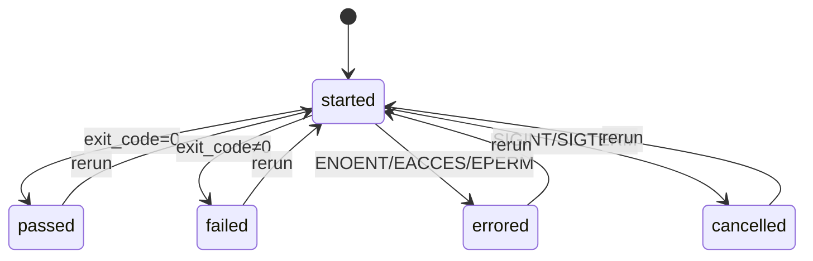

# Cognit

> Git for AI cognition.

Code has Git.
Tasks have Jira.
AI has Cognit.

Cognit is a local-first persistent decision and knowledge layer for AI-assisted engineering.

It records what AI workers learn, try, reject, verify, and conclude during software engineering tasks.

Cognit is not an agent framework.
Cognit is not a multi-agent platform.
Cognit is not a workflow engine.
Cognit is not a chat history database.
Cognit is not a backup tool.
Cognit is not a general-purpose knowledge management system.
Cognit is not a log aggregator.

Cognit is infrastructure for preserving engineering cognition.

---

## Why Cognit?

AI coding tools generate a large amount of useful reasoning:

- observations
- findings
- hypotheses
- experiments
- rejected approaches
- decisions
- verifications
- conclusions

But after a task ends, most of that reasoning disappears.

Usually only these remain:

- code
- commits
- pull requests
- short summaries

The investigation itself is lost.

Cognit exists to make that reasoning persistent, queryable, recoverable, and reusable.

What Cognit adds over `git log` and a notes file:

- **Typed entities** — not free text. You can query "all rejected hypotheses" reliably.
- **Decision lineage** — every decision points to the conclusions it was based on, every experiment points to the hypothesis it tested, every conclusion points to the verification that proved it.
- **Verification as first-class** — a hypothesis is only as good as the verification behind it. A complete lifecycle (`passed` / `failed` / `errored` / `cancelled`) means you never see a stale "in progress" status.
- **Resume without chat** — open a session six months later and recover rejected approaches, accepted decisions, and the strongest open hypothesis without loading old chat context.
- **Worker-agnostic** — Claude Code, Codex, OpenCode, Gemini CLI, or a custom script all publish into the same store.
- **Secret redaction at ingest** — JWTs, API keys, and PEM blocks never reach the store. Privacy is a default, not a feature you turn on.
- **Portable** — `cognit export` produces a bundle you can move to another machine, hand to a teammate, or check into a repo.

---

## Core Idea

Git manages code history.

Jira manages task history.

Cognit manages:

- knowledge history
- investigation history
- decision history
- verification history

AI workers are temporary.

State is permanent.

---

## State First

Most AI systems are agent-first:

```txt
Agent
├─ memory
├─ task
└─ context
```

Cognit is state-first:

```txt
Session
├─ Observations
├─ Findings
├─ Hypotheses
├─ Experiments (linked to the hypothesis they test)
├─ Decisions (based on conclusions)
├─ Conclusions (verified by verifications)
├─ Verifications (with full lifecycle)
├─ Edges (typed relationships between entities)
└─ Snapshots (state checkpoints for fast resume)
```

Workers attach to a session, publish events, and disappear.

The session state remains.

---

## Core Concepts

### Project and Session

Two scopes:

- **Project** — the top-level unit. In local-first mode, one project per `.cognit` directory, typically one git repository. Project name is captured from the directory name (or `--project` flag) at init time.
- **Session** — one investigation or engineering goal inside a project. A session can be _forked_ from a previous session via `cognit session resume`, which sets `parent_session_id` and inherits rejected/accepted context.

### Actor

Every event is written by an _actor_: a human, a worker AI (e.g. `claude-code`), or a system process. Identity is first-class so the future trust engine can reason about it. Unknown actors seen for the first time are auto-registered with a default trust score from `cognit.yaml` and an `actor_registered` event is emitted.

### Observation

A raw fact captured from the environment.

```txt
Next.js reaches 18GB VmPeak during local development.
```

### Finding

A meaningful interpretation of one or more observations.

```txt
Memory growth starts after HMR updates.
```

### Hypothesis

A possible explanation that can be tested. Has a lifecycle: `active → weakened | rejected | promoted`. Rejections carry a reason type: `evidence`, `superseded`, or `constraint`.

```txt
Turbopack cache is leaking memory.
```

### Theory

A group of related hypotheses, organized around a theme. First-class — not a label. Can be merged or archived.

```txt
HMR resource retention
```

### Experiment

A test designed to confirm, weaken, or reject a hypothesis. Always linked to the hypothesis it tests via a `tests` edge. The result records which hypotheses it `supports` and which it `contradicts` directly.

```txt
Disable Turbopack and observe memory growth.
```

### Decision vs Conclusion

Two different things, often confused:

- **Conclusion** — a verified claim about the world. "Turbopack is not the memory leak cause."
- **Decision** — an action commitment based on conclusions. "We will disable Turbopack in CI."

A decision `based_on` one or more conclusions. Conclusions `verified_by` a verification. This separation lets the dashboard answer "why does this decision exist" without conflating knowledge with action.

### Verification

The source of truth. A reproducible run of a command (lint, typecheck, test, build, benchmark, custom) with a complete lifecycle: `started → passed | failed | errored | cancelled`. `failed` and `errored` are different — `failed` means exit code != 0, `errored` means the command could not even run. A verification can also be `rerun`, with the previous run linked by `parent_verification_id`.

A conclusion should only be `verified` when it is backed by at least one passed verification.



Capture: stdout/stderr excerpt (≤1 MB inline) + sha256-keyed artifact file under `.cognit/artifacts/<id>.<ext>` when total output > 1 KB. Captures are linked from the `verification_passed` / `verification_failed` payload via `created_artifact_id`.

### Artifact

Evidence stored as a file, addressed by content hash (sha256).

- terminal logs
- benchmark output
- build output
- test reports
- heap snapshots
- git diffs
- screenshots

### Edge

A typed, queryable relationship between two entities. Edge types: `tests`, `supports`, `contradicts`, `supersedes`, `caused`, `based_on`, `belongs_to`, `derived_from`, `references`. Edges are first-class in the store — the knowledge graph is not reconstructed, it's queried.

---

## Event Sourcing

Cognit does not store chat history.

Cognit does not store chain-of-thought.

Cognit stores events.

Example events:

```txt
project_created
session_created
observation_recorded
finding_created
hypothesis_created
experiment_completed
hypothesis_rejected (reason_type: evidence | superseded | constraint)
decision_accepted
conclusion_verified
verification_passed
verification_errored
verification_rerun
edge_created
actor_registered
snapshot_created
```

Every event carries:

- `id` (ulid)
- `project_id`, `session_id` (foreign keys)
- `actor_id` (the source — human, worker, or system)
- `type` and `version` (schema version of the payload, for replay-time migration)
- `payload_json` (type-specific, validated by Effect Schema at ingest, redacted before write)
- `confidence` (0-1, set at event creation; entity-level confidence is derived)
- `causation_id` and `correlation_id` (for event-sourcing tracing)
- `created_at`

The current state of a session is rebuilt by replaying its event stream. Snapshots speed this up: the reducer restores the last snapshot and replays only events after it.

---

## Secret Redaction

Privacy is a default, not a feature. Every event is scanned for secret patterns at ingest and redacted before it reaches the store. Built-in patterns: JWT, API keys (inline `key=` / `api_key=` / `token=`), PEM private key blocks, password fields. Custom patterns are configured in `cognit.yaml`.

A `redaction_applied` event records that redaction happened (with pattern name and entity affected, but never the redacted content). The original plaintext never lands on disk.

> Redaction is at ingest, not retroactive. If you have a real secret in a past event, the old event is unchanged. To clean up an old leak, restore from an earlier `cognit export` and re-import — that is the only safe path.

---

## Knowledge Graph

Cognit stores knowledge as an explicit, typed graph.

```txt
Finding F1
├─ supports -> Hypothesis A
├─ contradicts -> Hypothesis C
└─ derived_from -> Observation O1

Experiment E1
└─ tests -> Hypothesis B

Conclusion K1 (verified)
└─ verified_by -> Verification V1

Decision D1
├─ based_on -> Conclusion K1
└─ caused -> Experiment E1
```

Edges are stored in a dedicated `edges` table with type, from/to entity references, and session id. The knowledge graph in the dashboard is rendered by querying edges — not by scanning events.

> Note: the `caused` edge type is `decision → experiment` (a decision causes an experiment to be run), not `experiment → conclusion`. The graph above is the canonical example: a verified conclusion is linked to its verification via `verified_by`, and a decision is linked to the experiment it caused and the conclusion it was based on.

---

## Decision Graph

```txt
Decision: Disable Turbopack in CI (accepted)
├─ based_on -> Conclusion: Turbopack is not the memory leak source (verified)
│                └─ verified_by -> Verification: mem-test-without-turbopack (passed)
└─ caused -> Experiment: Disable Turbopack and measure memory growth
                └─ tests -> Hypothesis: Turbopack cache is leaking memory (rejected, reason: evidence)
```

The goal is to answer:

```txt
Why does this conclusion exist?
Why was this approach rejected?
What evidence supports this decision?
What verification proved this conclusion?
```

---

## Gravity Engine

Gravity is the priority score of a hypothesis or decision. It tells the recovery engine which open hypothesis to investigate first.

Inputs:

- evidence strength (count of supporting findings/conclusions)
- reproducibility (count of passed verifications, weighted by recency)
- verification confidence
- actor trust (weighted by the actor.trust_score of contributing events)
- risk, cost, reversibility (user-assigned)
- **freshness decay** — older unverified claims lose score, so the queue doesn't get stuck on stale hypotheses

The v0.2 Gravity Engine is a simple weighted sum. The future plan is a learned model with per-domain weights.

---

## Constraint Engine

The Constraint Engine applies dependency and exclusion rules between states. (Originally called "Entanglement Engine"; renamed because the internal model is a plain rule engine and "entanglement" implied something it isn't.)

Rules are stored as JSON in the `constraint_rules` table and evaluated against the triggering event plus current entity state. Rules fire on `experiment_completed` and `verification_failed` events.

Example rule (JSON):

```json
{
  "condition": {
    "all": [
      { "event": "experiment_completed", "contradicts_includes": "$h.id" },
      { "entity": "hypothesis", "id": "$h.id", "state": "active" },
      { "entity": "hypothesis", "id": "$h.id", "confidence": { "lt": 0.3 } }
    ]
  },
  "actions": [
    {
      "type": "reject_hypothesis",
      "reason": "Contradicted by experiment and low confidence",
      "reason_type": "constraint"
    }
  ]
}
```

The condition DSL uses `all`, `any`, and `not` as logical operators. Each clause is either an **event matcher** (`{"event": "experiment_completed", ...}`) or an **entity matcher** (`{"entity": "hypothesis", "id": "$h.id", "state": "active"}`). `$h` is a bound variable scoped to the hypothesis that was tested or linked in the triggering event. Numeric comparisons: `lt`, `lte`, `gt`, `gte`, `eq`.

Available actions: `reject_hypothesis`, `weaken_hypothesis`, `promote_hypothesis`, `create_finding`.

One experiment result can automatically prune multiple investigation branches.

---

## Dashboard

Cognit includes a local dashboard.

Default port: `6970`

Pages:

- **Overview** — goal, confidence, progress, current strongest hypothesis, latest verification
- **Timeline** — event stream evolution, filterable by type and actor
- **Knowledge Graph** — all entities as nodes, all edge types as links; layout toggle between free and physics ("constellation")
- **Decision Graph** — decisions with `based_on` edges to conclusions, and `caused` edges to experiments
- **Verification** — all verifications with their final state, with rerun history per hypothesis
- **Recovery Center** — related sessions, rejected hypotheses (with reason type), verified conclusions, accepted decisions, suggested next steps
- **Settings** — project config, redaction patterns, cleanup policy, storage usage, export/import buttons

---

## Docker

One-line local deploy. The stack is two services: a tsup-built
server on an internal docker network, and an nginx front-end that
serves the Vite dashboard on `:6970`.

```bash
docker compose up -d
open http://localhost:6970
# sign in with token "dev-token"
```

The server's data persists in the `cognit-data` named volume. To
wipe and re-seed:

```bash
docker compose down -v && docker compose up -d
```

Port policy: `:6970` is the only host-facing port; `:6971` stays
on the internal docker network. Non-docker users
(`pnpm dev:server` + `pnpm dev:dashboard`) are unaffected.

---

## Installation

```bash
pnpm install
pnpm build
pnpm link --global
```

---

## Quick Start

### 1. Initialize Cognit in a repository

```bash
cognit init
```

This creates `.cognit/cognit.db`, `.cognit/cognit.yaml`, the rest of the directory structure, and a `.cognit/.gitignore` snippet. Append its contents to your repo's `.gitignore`:

```gitignore
# appended by cognit init
.cognit/cognit.db
.cognit/inbox/
.cognit/snapshots/
.cognit/archive/
.cognit/.gitignore
```

Commit `.cognit/cognit.yaml` (your config). Commit `.cognit/artifacts/curated/` selectively for deliberate evidence you want to share.

### 2. Create a session

```bash
cognit session create "Fix Next.js memory leak"
```

The CLI prints the session id (a ulid). Use `--session` later for precision.

### 3. Record an observation

```bash
cognit observation add "Next.js reaches 18GB VmPeak during local development"
```

### 4. Create a hypothesis and link it to a theory

```bash
cognit theory add "HMR resource retention"
cognit hypothesis add "Turbopack cache is leaking memory" \
  --belongs-to "HMR resource retention" --confidence 0.7
```

### 5. Create an experiment that tests the hypothesis

```bash
cognit experiment add "Disable Turbopack and measure memory growth" \
  --tests "Turbopack cache is leaking memory"
```

### 6. Complete the experiment and record which hypotheses it affects

```bash
cognit experiment complete \
  --result "Memory still increases after disabling Turbopack" \
  --contradicts "Turbopack cache is leaking memory"
```

### 7. Reject the hypothesis with a typed reason

```bash
cognit hypothesis reject "Turbopack cache is leaking memory" \
  --reason "Disabling Turbopack did not stop memory growth" \
  --reason-type evidence
```

### 8. Propose a new hypothesis, run a verification, and propose a conclusion

```bash
cognit hypothesis add "Module graph listener leak in HMR" \
  --belongs-to "HMR resource retention" --confidence 0.6

cognit verify --type benchmark --command "pnpm run bench:memory" \
  --tests "Module graph listener leak in HMR"
# the verify command prints a verification id; the verification record
# carries linked_hypothesis_id pointing at the hypothesis above (not an edge)

cognit conclusion propose "Memory leak is in the HMR module graph, not Turbopack"

cognit conclusion verify <conclusion-id> --with <verification-id>
```

### 9. Accept a decision based on the conclusion

```bash
cognit decision accept "Disable HMR module caching in CI" \
  --reason "Memory leak source is the module graph, not Turbopack" \
  --based-on <conclusion-id>
```

### 10. Open the dashboard

```bash
cognit dashboard
```

Visit `http://localhost:6970`.

---

## Resuming an Investigation

Later, when reopening the same task:

```bash
cognit session resume "Fix Next.js memory leak"
```

By default this forks a new session from the most recent match. The new session has `parent_session_id` set and inherits a context summary:

```txt
Previous session found (01HXY...).

Goal:
Fix Next.js memory leak

Rejected hypotheses:
- Turbopack cache leak (reason: evidence)
- Production memory leak (reason: evidence)

Verified conclusions:
- Memory leak is in the HMR module graph, not Turbopack (verified by verification 01HXY...)

Accepted decisions:
- Disable HMR module caching in CI

Last known state:
Root cause narrowed to HMR module graph

Suggested next step:
Investigate module graph retention; strongest active hypothesis: "module listener leak"
```

> **Versioning note:** the core `cognit session resume` command ships in Bootstrap (Phase 2) and returns rejected hypotheses, verified conclusions, and accepted decisions out of the box. The `Last known state` line requires the Recovery Engine, which lands in v0.2 (Phase 7). The `Suggested next step` line requires the Gravity Engine, which lands in v0.2 (Phase 8). On v0.1, both lines are omitted; the resume output still works without them.

No old chat context is required.

To resume into the same session instead of forking, pass `--fork=false`. If multiple open sessions match the goal, the most recently created one is picked and a warning is printed; pass `--id <ulid>` for precision.

---

## Inspecting the Event Stream

For terminal-first inspection, without launching the dashboard:

```bash
cognit events --session <id> --type verification_failed --follow
```

`cognit events` reads from the same SQLite store that the dashboard does, with filters for session, type, actor, and a `--follow` mode that polls for new events as they are appended. `--follow` reads directly from SQLite and works without the API server running — it is available from Bootstrap onward.

---

## Inspecting a Session

```bash
cognit session show <id-or-goal>
```

Prints the reducer output: rejected hypotheses, verified conclusions, accepted decisions, last known state, and all events in chronological order. Useful for a full audit of an investigation without opening the dashboard.

---

## Local Storage

```txt
.cognit/
├─ cognit.db
├─ cognit.yaml
├─ .gitignore
├─ inbox/
│  ├─ <session-id>-<ulid>.json     # pending events from workers
│  └─ _error/                      # invalid files, kept for debugging
├─ artifacts/
│  └─ curated/                     # deliberately committed evidence
├─ snapshots/                      # state checkpoints
└─ archive/                        # gc'd artifacts, compressed
```

The SQLite database is the source of truth. The event stream is append-only. Snapshots are append-only too — they accelerate replay but never replace events.

---

## Worker Model

Cognit workers are temporary compute processes. They may be:

- Claude Code
- Codex
- OpenCode
- Gemini CLI
- custom scripts
- humans

Workers do not own memory.

Workers publish events.

Cognit owns state.

---

## Worker Inbox Adapter

The first adapter is intentionally simple. Any worker can publish events by writing JSON files into `.cognit/inbox/`. The watcher (chokidar) reads each file, validates its JSON shape and Effect Schema, detects atomic writes (the `.tmp` + rename protocol), and forwards the event to `appendEvent` — which is the single redaction boundary in the store. The watcher itself does not redact; the same redaction invariant is enforced for CLI direct writes, SDK calls, and the future HTTP `POST /events` endpoint, because every write path goes through `appendEvent`.

Atomic write protocol (so partial writes are not picked up):

1. Write payload to `<file>.tmp`
2. `fsync`
3. Rename to `<file>.json` (atomic on POSIX, near-atomic on Windows)

Example event file:

```json
{
  "schema_version": "1.0.0",
  "type": "hypothesis_created",
  "session_id": "01HXY...",
  "actor": { "type": "worker", "name": "claude-code" },
  "source": { "tool": "cognit", "command": "cognit hypothesis add ..." },
  "payload": {
    "title": "Runtime listener leak"
  },
  "confidence": 0.72
}
```

The watcher auto-registers unknown actors with a default trust score from `cognit.yaml` and emits an `actor_registered` event. The full inbox-to-store field mapping is documented in `plan.xml` under `<worker_adapter><inbox_to_store_mapping>`.

### Auto-capture with `cognit wrap`

To make capture frictionless:

```bash
cognit wrap -- claude-code --print "Investigate the memory leak"
```

`cognit wrap` runs the wrapped command, captures tool calls, exit codes, and stderr lines as observations, and emits them as events. This is the recommended way to onboard a new worker.

> **Versioning note:** the inbox adapter (writing JSON files into `.cognit/inbox/`), the `cognit wrap` shim, and the Claude Code / Codex / OpenCode / Gemini CLI hook docs all land in v0.2 (Phase 9). For Bootstrap (phases 0-4) and v0.1 (phases 0-6), the supported onboarding is CLI commands issued by the human.

For Claude Code specifically, configure hooks in `.claude/settings.json`:

```json
{
  "hooks": {
    "PostToolUse": "cognit observation add",
    "PreToolUse": "cognit hypothesis add"
  }
}
```

---

## Export and Import

A session is a portable bundle.

```bash
cognit export --output investigation-2026-06-12.tar.gz --include-artifacts
cognit import --input investigation-2026-06-12.tar.gz --merge-strategy skip
```

The bundle is a `tar.gz` of the SQLite dump, the `artifacts/` directory, and `cognit.yaml`. Use it to back up, transfer between machines, or share a session with a teammate. `--merge-strategy fork` keeps the imported session separate from any local session with the same goal.

---

## CLI Reference

```bash
cognit init [--project name]
cognit config [--edit] [--show]

cognit project list

cognit session create "goal" [--parent session-id]
cognit session list [--status active|paused|closed]
cognit session resume "goal-or-id" [--fork=true] [--id ulid]
cognit session pause
cognit session close
cognit session show <id-or-goal>

cognit snapshot

cognit append --type <event-type> --payload <json|file> [--session <id>] [--actor name:type]

cognit observe "text" [--session <id>] [--confidence 0..1]
cognit finding "text" [--related <obs-id,obs-id>] [--confidence 0..1]
cognit hypothesis propose "title" [--text "body"] [--confidence 0..1]
cognit hypothesis weaken --id <h-id> --reason-type evidence|superseded|constraint
cognit hypothesis reject --id <h-id> --reason "..."
cognit hypothesis promote --id <h-id>
cognit theory add "text" [--confidence 0..1]
cognit theory merge --id <theory-id> --into <target-id>
cognit theory archive --id <theory-id>
cognit experiment add "text" --tests <h-id> [--supports id,id] [--contradicts id,id]
cognit experiment complete --id <exp-id> --result "text"
cognit decision propose "text" [--based-on <conclusion-id,id>]
cognit decision accept --id <d-id> --reason "..."
cognit decision reject --id <d-id> --reason "..."
cognit conclusion propose "text" [--based-on <h-id,id>]
cognit conclusion verify --id <c-id> --with <verification-id>
cognit conclusion reject --id <c-id> --reason "..."

cognit verify start --type build|test|lint|typecheck|benchmark|custom --command "cmd" [--tests <h-id>]
cognit verify cancel --id <verification-id>
cognit verify pass --id <verification-id>
cognit verify fail --id <verification-id>
cognit verify error --id <verification-id> --reason "..."
cognit verify rerun --parent <verification-id> --command "cmd" --type <type>

cognit artifact add <file> --kind <kind>

cognit edge add --from <entity:id> --to <entity:id> --kind supports|contradicts|tests|based_on|derived_from
cognit edge list [--session <id>] [--kind <kind>]

cognit constraint add --json '{"when":{...},"then":{"kind":"block"},"reason":"..."}'
cognit constraint list
cognit constraint test --type <event-type> [--payload <json|file>]

cognit redaction test "<raw string>"

cognit export --output <bundle.tar.gz> [--include-artifacts]
cognit import --input <bundle.tar.gz> [--merge-strategy skip|overwrite|fork]

cognit gc [--dry-run] [--force] [--max-age-days N]

cognit events [--session <id>] [--type <event-type>] [--limit <n>] [--follow]

cognit inbox [--watch|--process]
cognit schema-dump

cognit server [--host <ip>] [--port <n>] [--root <p>]

cognit --json <command>             # emit the v1 JSON envelope
```

All commands run on the sticky `current-session` pointer when `--session` is omitted; an explicit `--session <id>` always wins.

### Bundle format (`cognit export` / `cognit import`)

`cognit export` produces a `.tar.gz` with this layout:

```text
manifest.json   # { format_version: 1, created_at, project_name, schema_version }
cognit.yaml     # verbatim copy of the project config
cognit.db       # SQLite snapshot (VACUUM INTO)
artifacts/      # only when --include-artifacts is passed
```

`cognit import --merge-strategy <s>` decides what to do when an
imported row collides with a local row:

- `skip` — keep local, drop the imported row (default; safe to re-run)
- `overwrite` — replace the local row with the imported one
- `fork` — rewrite every imported id and remap FK columns
  (`session_id`, `actor_id`, `causation_id`, `parent_verification_id`,
  `linked_hypothesis_id`, edge `from/to`) so both sides survive

### Deferred to v0.2 / phase 5

`cognit wrap` and the dashboard on port 6970 are not yet shipped. Run
`cognit --help` to see the live command list.

---

## Configuration (cognit.yaml)

```yaml
project:
  name: cognit # set automatically from directory name at init

redaction:
  enabled: true
  # built-in patterns (jwt, api_key_inline, pem_block, password_field) are always applied
  patterns:
    - name: internal_bearer
      regex: "Bearer [A-Za-z0-9._-]{20,}"
      replacement: "Bearer [REDACTED]"

cleanup:
  artifact_max_age_days: 30
  unreferenced_action: archive # archive | delete | keep
  max_db_size_mb: 1024

session:
  snapshot_every_n_events: 100
  fork_on_resume: true

actors:
  defaults:
    human: 0.9
    worker: 0.6
    system: 1.0
  known:
    - name: claude-code
      trust_score: 0.7
    - name: codex
      trust_score: 0.65

inbox:
  watch: true
  debounce_ms: 200
  atomic_write_required: true

server:
  # opt-in bearer auth. Off by default on loopback bind. Required
  # when --host is non-loopback (e.g. 0.0.0.0) — every /sessions/*
  # and /events/* route returns 401 without a matching token.
  api_token: "" # set to a non-empty string to require auth
```

Edit with `cognit config --edit`. Show with `cognit config --show`.

---

## Development

```bash
pnpm dev:server
pnpm dev:dashboard
pnpm dev:cli
pnpm check
```

---

## v0.1 Success Criteria

Cognit v0.1 is complete when it can:

- create and resume sessions locally (resume forks by default; pass `--fork=false` to append); the resume block returns rejected hypotheses, verified conclusions, and accepted decisions
- record observations, findings, hypotheses, experiments, decisions, conclusions, and verifications through first-class `cognit observe / finding / hypothesis / theory / experiment / decision / conclusion / verify / artifact / edge` subcommands
- resolve a sticky `current-session` pointer so entity commands can run with no `--session` flag; `--session` always overrides the pointer
- emit a stable `--json` envelope (`{ version: 1, kind, data }`) for every command, parseable by `jq`
- enforce typed constraint rules via `cognit constraint {add,list,test}` (closed v1 predicate set of 13); non-violating events still produce a `constraint_rule_applied` audit row in the same tx
- store events in SQLite with explicit redaction at ingest
- rebuild session state from events (with snapshot acceleration)
- attach artifacts as evidence
- show why a decision exists, with `based_on` edges to verified conclusions
- serve a Hono read API on `127.0.0.1:6971` (`cognit server`) with `GET /sessions/:id/state`, `GET /events/stream` (SSE), `POST /events` (funnelled through `appendEvent` so redaction + constraint still apply), and opt-in bearer auth on non-loopback bind
- tail the event stream from the terminal with `cognit events --follow`, without requiring the API server

**Phase 3 status (Cognit-5vl):** shipped. E2E coverage in `apps/cli/test/phase-3.e2e.test.ts` and `apps/server/test/phase-3.server.e2e.test.ts`. Test counts: 149 db / 82 cli / 52 core / 15 server (targets met: 130+ / 60+ / 50+ / 10+).

A smaller **Bootstrap** (no API, no dashboard) only needs to ship phases 0-4 of the implementation plan and is enough to validate the data model with real sessions.

Deferred to v0.2 / phase 4: dashboard on port 6970, MCP transport, reasoning traces
(`thought_logged`), webhooks, multi-actor RLS, incremental snapshots, fuse.js / semantic
search, background snapshot sweeper, snapshot file mirror, per-event `from_event_id`
fork, `cognit doctor` / `cognit gc` / `cognit project info` / `cognit wrap` /
`cognit redaction test` / `cognit export` / `cognit import`, atomic-write enforcement
flag, v0.1 release artifact.

---

## Future Direction

Future directions include:

- semantic search for better recovery (post-v0.2)
- Git integration: link sessions to branches, commits, and diffs
- plugin adapters for Claude Code, Codex, OpenCode, Gemini CLI, and custom workers
- trust engine: per-actor trust with history and override
- stronger Gravity Engine with learned weights
- supervisor mode: a long-running worker that observes, ranks, assigns, verifies, prunes, and resumes investigations
- remote sync for team usage while keeping local-first mode
- shared project cognition with per-actor write permissions
- event compaction and archival beyond the simple gc
- artifact encryption at rest (now that redaction keeps plaintext out of events)
- multi-tenant workspaces (add `workspace_id` back as a schema migration)
- web dashboard for shared/team mode (v0.1 dashboard is single-user local)

The long-term goal is simple:

Git preserves code evolution.

Cognit preserves reasoning evolution.

AI reasoning should not disappear when the context window ends.
