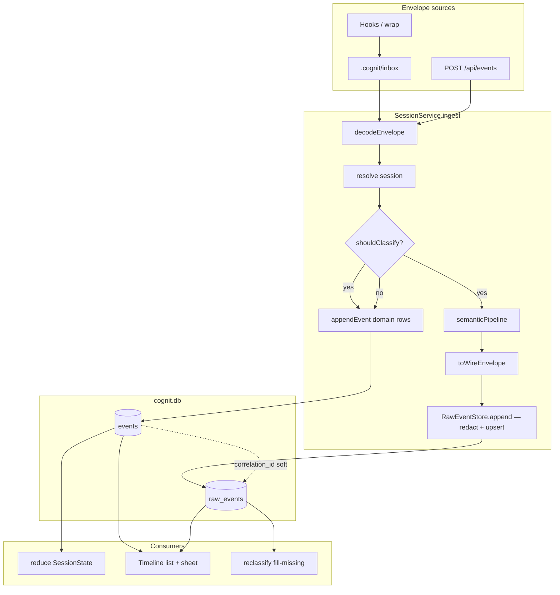
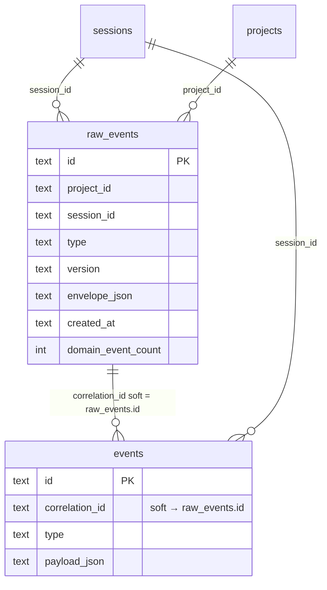

# D-M6-00 — Dual logical event stores (raw + domain) in one SQLite file

| Field | Value |
|-------|-------|
| **Document id** | D-M6-00 |
| **Author** | Cognit systems design |
| **Date** | 2026-07-17 |
| **Status** | Draft (rev 2 — design review addressed) |
| **DB schema version target** | **1.4.0** (`schema_version` table / `migrations.ts`) |
| **Event payload `CURRENT_VERSION`** | **remains `1.3.0`** (not bumped) |
| **Predecessors** | D-M5-00 (semantic events), D-M4-00 (inbox OOB ingest), D-M1-04 (redaction wiring), **D-M0-04 (server migration packaging — hard dep for dist server)** |
| **Option** | **A** — one SQLite file, two logical stores (`raw_events` + `events`) |

---

## Overview

After D-M5-00, hooks emit full `raw_tool_signal` envelopes into `.cognit/inbox/`. The semantic pipeline at `SessionService.ingest` classifies them and appends **truncated domain summaries** (e.g. `action_recorded` with `evidence.summary` capped at 240 chars). The full wire envelope is only retained as a JSON file under `.cognit/processed/<id>.json`. The dashboard Timeline reads domain rows from SQLite only; sheet detail shows the summary payload; `GET /api/events/:id` is not implemented. On a real project (gigsberg-wlb), this yields **0** `raw_tool_signal` rows in SQLite despite 214 processed envelopes and 103 domain events.

**Option A** introduces a second logical store in the **same** `cognit.db` file:

1. **`raw_events`** — redacted full transport envelopes in **wire snake_case JSON** (SSOT for evidence / forensic UI / best-effort reclassify).
2. **`events`** — domain/summary events (SSOT for reducer `SessionState`, timeline, search) — **role unchanged**.

Domain rows link to raw via soft `events.correlation_id → raw_events.id`. Export already `VACUUM INTO`s the whole DB, so raw is portable without a second file or `processed/` in the bundle.

**Versioning note (rev 2):** SQLite DDL version **1.4.0** is independent of event payload / envelope wire version **1.3.0**. See [KD-2](#key-decisions) and [Schema versioning](#schema-versioning-db-vs-payload).

---

## Background & Motivation

### Current pipeline (D-M5-00)

```
.cognit/inbox/*.json
        │
        ▼
 packages/db/src/inbox.ts::processFile
        │
        ▼
 SessionService.ingest  (session-service.ts ~1342)
        │
        ├─ shouldClassify? (raw_tool_signal | legacy Pre/Post hooks)
        │     │
        │     ▼
        │  semanticPipeline (normalize → classify → soft-refine → produce)
        │     │
        │     ├─ produced.length === 0 → skip domain append (synthetic row for rename)
        │     └─ for each ProducedEvent → appendEvent
        │           id = derivedDomainEventId(envelopeId, i)  // i=0 reuses envelope ULID
        │           correlationId = envelopeId
        │
        └─ else → single-append envelope as domain event (CLI verbs, etc.)
        │
        ▼
 rename → .cognit/processed/<eventId>.json   (full original file, unredacted on disk)
```

### Verified gap (gigsberg-wlb)

| Store | Content | Typical size |
|-------|---------|--------------|
| `.cognit/processed/01KXQRJKW27TS0TXQT3Q6S4W2D.json` | Full `raw_tool_signal` (`tool_input.old_string` / `new_string`, `tool_response`) | ~7342 B |
| `events` row same id | `action_recorded` summary only | ~489 B |
| `events` where type = `raw_tool_signal` | **0 rows** | — |

Produce intentionally truncates (`packages/core/src/semantics/produce.ts`):

```9:12:packages/core/src/semantics/produce.ts
export const EVIDENCE_SUMMARY_MAX = 240;
export const EVIDENCE_EXCERPT_MAX = 800;
/** When tool input content exceeds this, mark evidence.truncated. */
export const LARGE_CONTENT_THRESHOLD = 4_000;
```

Ingest classification path never appends the transport envelope (`session-service.ts:1337–1340`). That is correct for the **reducer** (raw must not fold into `SessionState`), but wrong for **forensics / UI detail / reprocess-from-DB**.

### Pain points

1. Timeline sheet cannot show old/new string diffs or full tool_response.
2. Reclassify after classifier improvements depends on `processed/` files (not in export bundle — `apps/cli/src/commands/export.ts` only packs manifest + yaml + `cognit.db` + optional artifacts).
3. Secrets may sit unredacted in `processed/` while domain rows go through `redactEvent` on append.
4. Two durability models (FS + SQLite) diverge under partial failure.

### Why not Option B / “read processed from dashboard”

| Option | Rejected because |
|--------|------------------|
| **B — second DB file** | Dual open/migration/export, WAL lock complexity, breaks single-file local-first story. |
| **Dashboard reads `processed/`** | Server would need project FS access patterns, no redaction guarantee, not portable via export, race with rename. Permanent FS dependency is anti-goal. |

---

## Goals & Non-Goals

### Goals

1. Persist **redacted** full wire envelopes in `raw_events` inside `cognit.db`.
2. Keep `events` as domain SSOT; reducer remains domain-only.
3. Stable **link** domain → raw via `correlation_id` (and indexes).
4. **Idempotent dual-write** with documented partial-failure recovery (raw-first, then domain). Single-transaction packaging is **out of v1** (see KD-13 / KD-16).
5. Backfill existing projects from `.cognit/processed/*.json`.
6. APIs for single domain event + raw evidence; Timeline sheet **Summary | Raw evidence** tabs.
7. Export/import include raw (same DB file); fork remaps soft correlation correctly.
8. Document size growth vs `cleanup.max_db_size_mb`; dual-write `processed/` for one release.
9. Enable **best-effort** reprocess/reclassify from `raw_events` without needing `processed/` (redacted SSOT; not bit-identical to first unredacted inbox ingest — KD-8b / Goals limitation).

### Non-Goals (v1)

- FTS / full-text search over `envelope_json`.
- New dashboard page or global “raw browser”.
- Automatic retention/pruning of old raw rows (document only; config later).
- Deprecating or deleting `processed/` in v1 (keep dual-write; optional prune CLI is follow-up).
- Changing produce truncation constants for domain payloads.
- Changing hook wire format or envelope version.
- Option B (second database file).
- Rewriting historical domain rows in place (reprocess = fill-missing only).
- **Atomic multi-write / nested SAVEPOINT packaging** (follow-up bead after v1).
- Hard reject of oversized envelopes (warn only above 1 MiB).
- Session-scoped raw list API (`GET /api/sessions/:id/raw-events`).
- Bumping event payload `CURRENT_VERSION` to 1.4.0 solely because of this DDL.

---

## Key Decisions

| # | Decision | Rationale |
|---|----------|-----------|
| KD-1 | **One SQLite file**, tables `raw_events` + `events` (Option A) | Export, WAL, migrations, doctor already assume single `cognit.db`. |
| KD-2 | **DB schema version 1.4.0 is independent of payload `CURRENT_VERSION` (stay 1.3.0)** | This design only adds a table. Bumping `CURRENT_VERSION` forces envelope Literal + identity transform for no benefit. Export/import must stop treating `CURRENT_VERSION` as the DB schema version (see [Schema versioning](#schema-versioning-db-vs-payload)). |
| KD-3 | Store **redacted full wire envelope JSON** (snake_case) in `envelope_json TEXT NOT NULL` | Round-trips through `decodeEnvelope`; dashboard/raw views use wire keys. |
| KD-4 | **`raw_events.id` = envelope ULID**; domain keeps **`derivedDomainEventId`** (index 0 reuses envelope id) | Minimal churn. **Same ULID in two tables is valid** (per-table PKs). |
| KD-5 | Link: **`events.correlation_id → raw_events.id`** for classify-path produces; all siblings share the same correlation | Multi-produce maps many domain → one raw. |
| KD-6 | **Ignore path still stores raw** (`domain_event_count = 0`) | Forensics for classifier false-ignores. |
| KD-7 | **Non-classify ingest** does **not** write `raw_events` | Envelope is already the domain event. |
| KD-8 | **Reducer never reads `raw_events`** | SessionState purity. |
| KD-8b | **DB reclassify is best-effort on redacted evidence** | Secrets replaced at rest; unredacted forensic replay uses `processed/` while dual-write exists. |
| KD-9 | **Keep `.cognit/processed/` dual-write for ≥1 release** | Safety net + backfill source. |
| KD-10 | **No FTS on raw in v1** | Cost/complexity. |
| KD-11 | **Dashboard: expand Timeline sheet only** | Smallest UX surface. |
| KD-12 | **Retention: document only in v1** | No automatic raw purge. |
| KD-13 | **v1 dual-write = sequential, raw-first, non-atomic** | Insert/update raw; on failure abort before domain loop; then domain appends (each existing tx). Partial states recoverable via reprocess. **No nested BEGIN / Phase 2 atomic in v1 train.** |
| KD-14 | Backfill CLI: **`cognit raw backfill`** (explicit; not silent on open) | Operator control + dry-run. |
| KD-15 | **Do not FK `events.correlation_id → raw_events(id)`** | Soft link + index; legacy correlation values may be non-raw. |
| KD-16 | **Atomic packaging out of v1 PR train** | `appendEvent` chokepoint includes constraints, transformers, snapshots, bus; not a small EventStore split. Follow-up bead only. |
| KD-17 | **No hard envelope size reject in v1**; warn log if `envelope_json` length > 1 MiB | Avoid surprising data loss; revisit if abuse appears. |
| KD-18 | **Defer list raw API** (`GET /api/sessions/:id/raw-events`) | Timeline only needs by-id raw. |
| KD-19 | **Reclassify = fill-missing domain only** (no rewrite of existing domain ids) | Append-only + EventStore idempotency. |
| KD-20 | **Wire reconstruction is mandatory**; redaction always inside `RawEventStore.append` | Callers cannot store camelCase `DecodedEnvelope` or skip redact. |
| KD-21 | **Raw upsert: first-write-wins `envelope_json`; always refresh `domain_event_count`** | Stable evidence body; count tracks latest produce length after re-ingest. |
| KD-22 | **Migration SQL packaging for CLI *and* server** | D-M0-04 / server `copy-migrations` is a hard predecessor (or lands in PR-1). CLI alone is insufficient for production server dist. |
| KD-23 | **Import order + fork remap for raw + correlation_id** | See [Export / Import](#export--import). |
| KD-24 | **`TABLES_DDL` stays 1.0.0 baseline; raw_events only in migration 0005** | Matches 1.2/1.3 pattern (`constraint_action_log` not mirrored into TABLES_DDL). Comment in `tables.ts` points at 0005. |

---

## Schema versioning (DB vs payload)

Two version numbers must **not** be conflated:

| Concept | Where | After D-M6-00 |
|---------|--------|----------------|
| **DB schema version** | `schema_version.version` row; `migrations.ts` entries | **`1.4.0`** (new migration) |
| **Event payload / wire version** | `CURRENT_VERSION` in `event-schema.ts`; envelope `version` field; payload schema maps | **stays `1.3.0`** |
| Export manifest (today) | `export.ts` writes `schema_version: CURRENT_VERSION` | **Bug/coupling** — must change |

### Required code changes for KD-2

1. Add exported constant next to migrations (or in `event-schema.ts` / `migrations.ts`):

   ```ts
   /** SQLite DDL head version. Independent of payload CURRENT_VERSION. */
   export const DB_SCHEMA_VERSION = "1.4.0" as const;
   ```

2. Keep `CURRENT_VERSION = "1.3.0"` and all payload maps / identity transforms as today.

3. **Export** (`apps/cli/src/commands/export.ts`):

   - Manifest field `schema_version` → read **actual** DB row  
     `SELECT version FROM schema_version WHERE id = 1`  
     (fallback `DB_SCHEMA_VERSION` if missing).
   - Optionally add `payload_version: CURRENT_VERSION` for clarity (recommended).

4. **Import** reporting: `sourceSchemaVersion` / target version from DB `schema_version` (or manifest), not from `CURRENT_VERSION`.

5. **Tests**:

   - `packages/db/test/migrate.test.ts`: expect `schema_version.version === "1.4.0"` after migrations.
   - `event-schema.test.ts`: continue asserting `CURRENT_VERSION === "1.3.0"`.
   - Export integration: manifest `schema_version` matches DB after open/migrate.

6. **Do not** add `"1.4.0"` to `EnvelopeSchema` version Literal unless a future design intentionally bumps payload versions.

**Rejected alternative:** Bump `CURRENT_VERSION` to 1.4.0 with identity payload transform — overkill for a table add; risks rejecting live hook envelopes if Literal handling is wrong.

---

## Proposed Design

### Architecture



### Link model



**ID coexistence (critical):**

- SQLite PRIMARY KEYs are **per-table**. `raw_events.id = '01KX…'` and `events.id = '01KX…'` (first domain produce) may both exist.
- Lookup must be **table-scoped**: `EventStore.get(id)` → `events`; `RawEventStore.get(id)` → `raw_events`.
- See [GET /api/events/:id/raw resolution](#get-apieventsidraw--resolution-algorithm) for the single canonical algorithm.

**Multi-produce example (verification start + outcome):**

| Table | id | correlation_id |
|-------|-----|----------------|
| raw_events | E | — |
| events (verification_started) | E | E |
| events (verification_passed) | E′ = derivedDomainEventId(E,1) | E |

### Sequence: classify-path ingest (v1)

```mermaid
sequenceDiagram
  participant Inbox
  participant Ingest as SessionService.ingest
  participant Pipe as semanticPipeline
  participant Raw as RawEventStore
  participant Dom as appendEvent
  participant FS as processed/

  Inbox->>Ingest: envelope JSON
  Ingest->>Ingest: decode + resolve session
  Ingest->>Pipe: classify / produce
  Note over Ingest,Pipe: pipeline first so domain_event_count is known
  Ingest->>Ingest: toWireEnvelope(decoded)
  Ingest->>Raw: append wire + domainEventCount=N
  Note over Raw: redact inside store; upsert semantics
  alt N == 0
    Note over Ingest,Raw: skipped=true; no domain loop
  else N > 0
    loop i = 0..N-1
      Ingest->>Dom: appendEvent(id=derived(E,i), correlationId=E)
    end
  end
  Inbox->>FS: rename processed/E.json on success
```

**Order (KD-13):** pipeline → raw upsert → domain loop. Raw failure **aborts before** domain loop. Domain partial failure mid-loop: raw already present with correct `domain_event_count`; reprocess fills remaining domain ids via EventStore idempotency.

---

## Data Model Changes

### DDL — `raw_events` (DB schema 1.4.0)

New file: `packages/db/src/schema/migrations/0005_raw_events_v1.4.0.sql`

```sql
-- 0005_raw_events_v1.4.0.sql
-- D-M6-00: dual logical event store — full redacted transport envelopes.
-- DB schema_version → 1.4.0. Does NOT change payload CURRENT_VERSION (1.3.0).

CREATE TABLE IF NOT EXISTS raw_events (
  id            TEXT PRIMARY KEY,
  project_id    TEXT NOT NULL REFERENCES projects(id),
  session_id    TEXT NOT NULL REFERENCES sessions(id),
  type          TEXT NOT NULL,
  version       TEXT NOT NULL,
  actor_name    TEXT NOT NULL,
  actor_type    TEXT NOT NULL CHECK (actor_type IN ('human','worker','system')),
  -- Full wire envelope after redaction (FLAT snake_case JSON object as text).
  envelope_json TEXT NOT NULL,
  -- Denormalized helpers for list/filter without parsing JSON.
  source_tool   TEXT,
  source_command TEXT,
  -- 0 when classifier ignored; N when N domain events produced.
  domain_event_count INTEGER NOT NULL DEFAULT 0,
  -- Optional: original inbox/processed basename for forensics (nullable).
  source_file   TEXT,
  created_at    TEXT NOT NULL
);

CREATE INDEX IF NOT EXISTS idx_raw_events_session_created
  ON raw_events(session_id, created_at);

CREATE INDEX IF NOT EXISTS idx_raw_events_project_created
  ON raw_events(project_id, created_at);

CREATE INDEX IF NOT EXISTS idx_events_correlation
  ON events(correlation_id);
```

### `TABLES_DDL` policy (KD-24)

**Migration-only** for the new table (consistent with 1.2.0 gravity column and 1.3.0 `constraint_action_log`):

- Do **not** append `raw_events` CREATE to `TABLES_DDL` (1.0.0 baseline remains the initial migration body).
- Add a short comment at the end of `tables.ts` listing post-1.0.0 objects and pointing at `migrations/0005_raw_events_v1.4.0.sql`.

### Row type — `packages/db/src/schema/rows.ts`

```ts
export interface RawEventRow {
  id: string;
  project_id: string;
  session_id: string;
  type: string;
  version: string;
  actor_name: string;
  actor_type: "human" | "worker" | "system";
  envelope_json: string;
  source_tool: string | null;
  source_command: string | null;
  domain_event_count: number;
  source_file: string | null;
  created_at: string;
}
```

### Migration runner — `packages/db/src/schema/migrations.ts`

```ts
const MIGRATION_0005_SQL = loadMigration("0005_raw_events_v1.4.0.sql");

// append to MIGRATIONS:
{
  version: "1.4.0",
  up: (db) =>
    Effect.try({
      try: () => {
        db.exec(MIGRATION_0005_SQL);
      },
      catch: (e) =>
        new DbError({ message: `migration 1.4.0 failed: ${String(e)}`, cause: e }),
    }),
},
```

Also export `DB_SCHEMA_VERSION = "1.4.0"` from a stable public path (`@cognit/db`).

### Migration packaging — CLI **and** server (KD-22)

| Surface | Today | Required for D-M6 |
|---------|--------|-------------------|
| CLI | `apps/cli/package.json` → `copy-migrations` into `dist/migrations` | New `0005_*.sql` auto-copied — **OK** |
| Server | `apps/server/package.json` `"build": "tsup"` only; **no** `migrations/` in dist | **ENOENT** at runtime when bundled `migrations.ts` does `readFileSync` relative to `import.meta.url` under `apps/server/dist/` |

**Hard dependency:** implement [D-M0-04](./D-M0-04-migration-packaging.md) (or equivalent) **before or in PR-1**:

1. Server `copy-migrations` script (same source: `packages/db/src/schema/migrations`).
2. `"build": "tsup && pnpm run copy-migrations"`.
3. CI smoke: `apps/server/dist/migrations/0005_raw_events_v1.4.0.sql` exists after build.
4. Boot / migrate test from server dist path.

Dev via `tsx` against `@cognit/db` source continues to work without copy; **production server dist does not**.

### Size estimate (order-of-magnitude)

| Scenario | Envelopes | Mean envelope | Raw table ≈ |
|----------|-----------|---------------|-------------|
| gigsberg-wlb sample | 214 | ~7 KB | ~1.5 MB |
| Heavy day (5k tool calls) | 5_000 | 10 KB | ~50 MB |
| Default `cleanup.max_db_size_mb` | — | — | 1024 MB |

Domain `events` remain ~0.5 KB/row. **Raw will dominate** `cognit.db` size after dual-store.

Warn log when a single `envelope_json` exceeds **1 MiB** (KD-17); still insert.

---

## Wire envelope reconstruction (KD-20)

`decodeEnvelope` returns **camelCase** `DecodedEnvelope` (`sessionId`, `actorName`, …) while wire / `processed/` / hooks use **FLAT snake_case** (`session_id`, `actor_name`, …) per `EnvelopeSchema` (`envelope.ts:55–84`).

**Never** `JSON.stringify(decoded)` into `envelope_json`.

### Pure helper (new, e.g. `packages/db/src/envelope.ts` or `raw-event-store.ts`)

```ts
/** Reconstruct FLAT wire envelope for storage / re-ingest. */
export const toWireEnvelope = (d: DecodedEnvelope): Record<string, unknown> => {
  const wire: Record<string, unknown> = {
    type: d.type,
    version: d.version,
    session_id: d.sessionId,
    actor_name: d.actorName,
    actor_type: d.actorType,
    payload: d.payload,
  };
  if (d.id !== undefined) wire["id"] = d.id;
  if (d.source !== undefined) {
    wire["source"] = {
      tool: d.source.tool,
      command: d.source.command,
      // Wire Schema uses filePath (camelCase) inside source today — keep parity
      // with EnvelopeSchema (envelope.ts:67–71).
      ...(d.source.filePath !== undefined ? { filePath: d.source.filePath } : {}),
    };
  }
  if (d.artifactRefs !== undefined) wire["artifactRefs"] = d.artifactRefs;
  if (d.causationId !== undefined) wire["causationId"] = d.causationId;
  if (d.correlationId !== undefined) wire["correlationId"] = d.correlationId;
  if (d.confidence !== undefined) wire["confidence"] = d.confidence;
  if (d.parentVerificationId !== undefined) wire["parentVerificationId"] = d.parentVerificationId;
  if (d.linkedHypothesisId !== undefined) wire["linkedHypothesisId"] = d.linkedHypothesisId;
  return wire;
};
```

**Field map (Decoded → wire):**

| DecodedEnvelope | Wire key |
|-----------------|----------|
| `type` | `type` |
| `version` | `version` |
| `sessionId` | `session_id` |
| `actorName` | `actor_name` |
| `actorType` | `actor_type` |
| `payload` | `payload` (unchanged object graph) |
| `id` | `id` |
| `source` | `source` (`tool`, `command`, optional `filePath`) |
| `artifactRefs` | `artifactRefs` |
| `causationId` | `causationId` |
| `correlationId` | `correlationId` |
| `confidence` | `confidence` |
| `parentVerificationId` | `parentVerificationId` |
| `linkedHypothesisId` | `linkedHypothesisId` |

Note: envelope top-level uses snake_case for session/actor; optional link fields stay camelCase as in `EnvelopeSchema` today. Implementers must match `EnvelopeSchema` exactly — do not invent new key styles.

**Round-trip test:** `JSON.parse(envelope_json)` → `decodeEnvelope` → Right.

**Alternative allowed for backfill:** if original parsed object already validated via `decodeEnvelope`, may start from the **original parse object** (wire shape) rather than rebuild — still must pass through `RawEventStore.append` redaction. Prefer `toWireEnvelope` for the live ingest path so resolved session rewrite is explicit if ever needed (`session_id` stays envelope’s original session id in storage; domain may have been retargeted — **store the decoded/wire session_id as on the envelope**, while `raw_events.session_id` column stores the **resolved** session id used for FK).

**Column vs envelope session:**

- `raw_events.session_id` = **resolved** session (after sticky/lazy create) — same session domain events attach to.
- `envelope_json.session_id` = value from wire reconstruction (may be placeholder); reclassify should use store path that re-resolves or injects resolved session — reclassify CLI passes `lazyCreate: false` and may rewrite session before ingest (implementation detail: re-ingest with envelope whose `session_id` is set to the raw row’s `session_id` column).

---

## Ingest Path Changes

### File: `packages/db/src/session-service.ts` — `_ingest`

On **`shouldClassify(decoded)`** after session resolve:

1. Run `semanticPipeline(...)` → `produced` (length N).
2. Ensure envelope id: `rawId = decoded.id ?? yield* uuid.make()`.
3. `wire = toWireEnvelope({ ...decoded, id: rawId })`.
4. **`RawEventStore.append`** (fails → entire ingest fails; **no domain loop**):
   - inputs below; redaction inside store.
5. If N === 0: synthetic skip return (`skipped: true`) as today.
6. Else domain loop unchanged:
   - `derivedDomainEventId(rawId, i)`
   - `correlationId: rawId`

### Denormalized column population (ingest + backfill)

| Column | Rule |
|--------|------|
| `source_tool` | `wire.source?.tool ?? payload.tool ?? null` (string only) |
| `source_command` | `wire.source?.command ?? null` |
| `created_at` | **Live ingest:** `nowIso()`. **Backfill:** `nowIso()` at backfill time (not file mtime — simpler, deterministic tests). |
| `source_file` | Optional; inbox/backfill basename (`01….json`); null if unknown |
| `domain_event_count` | `produced.length` (0 on ignore) |
| `type` / `version` / actors | From decoded / wire |
| `project_id` / `session_id` | Resolved session’s project + session |

### New module: `packages/db/src/raw-event-store.ts`

```ts
export interface AppendRawEventInput {
  readonly id: string;
  readonly projectId: string;
  readonly sessionId: string;
  readonly type: string;
  readonly version: string;
  readonly actorName: string;
  readonly actorType: ActorType;
  /** Unredacted wire object (snake_case). Store always redacts. */
  readonly envelope: Record<string, unknown>;
  readonly sourceFile?: string | null;
  readonly domainEventCount: number;
}

export interface RawEventStoreShape {
  readonly append: (
    input: AppendRawEventInput,
  ) => Effect.Effect<RawEventRow, DbError | UnknownSession>;
  readonly get: (id: string) => Effect.Effect<RawEventRow, NotFound>;
  /**
   * Resolve raw for a domain event id or a raw id.
   * Implements the same algorithm as GET /api/events/:id/raw.
   */
  readonly resolveForEventId: (
    eventOrRawId: string,
  ) => Effect.Effect<{ row: RawEventRow; domainEventId: string | null }, NotFound>;
}
```

### Raw upsert algorithm (KD-21)

Inside `RawEventStore.append` (always redacts first):

```ts
const redacted = redactor.redactValue(input.envelope);
const envelopeJson = JSON.stringify(redacted);
if (envelopeJson.length > 1_048_576) {
  yield* logger.log("warning", { id: input.id, bytes: envelopeJson.length },
    "raw_events: envelope_json exceeds 1MiB");
}
// populate denormalized fields from redacted wire
const sourceTool = ...;
const sourceCommand = ...;
```

SQL (single statement preferred):

```sql
INSERT INTO raw_events (
  id, project_id, session_id, type, version,
  actor_name, actor_type, envelope_json,
  source_tool, source_command, domain_event_count,
  source_file, created_at
) VALUES (?, ?, ?, ?, ?, ?, ?, ?, ?, ?, ?, ?, ?)
ON CONFLICT(id) DO UPDATE SET
  domain_event_count = excluded.domain_event_count,
  source_file = COALESCE(excluded.source_file, raw_events.source_file)
  -- intentionally NO update to envelope_json, created_at, type, version, …
;
```

| On conflict | Behavior |
|-------------|----------|
| `envelope_json` | **First-write-wins** (not replaced) |
| `domain_event_count` | **Always refreshed** to latest produce length |
| `source_file` | Set if new value non-null; else keep old |
| Other columns | Unchanged |

Then `SELECT *` return row.

**Tests:** first insert; re-insert same id keeps envelope_json; count 0→N; warn path optional.

### Idempotency

| Operation | Mechanism |
|-----------|-----------|
| Re-drain same file | Domain: EventStore existing-id. Raw: ON CONFLICT count refresh. |
| Partial crash after raw, before/during domain | Reprocess fills domain; raw present. |
| Classifier change ignore→produce | Domain new appends if ids free; count UPDATE to N. Existing domain ids **not** rewritten (KD-19). |
| Raw append failure | Ingest fails; no domain; inbox → `_error` (not processed). |

### Non-classify path

No `raw_events` write.

### Inbox rename

Unchanged success → `processed/`. Raw failure prevents success → no processed rename.

---

## ID Policy Analysis

| Policy | Pros | Cons |
|--------|------|------|
| **A. Keep reuse (chosen)** | Zero change to derived ids, rename, correlation | Same id in two tables needs careful APIs |
| **B. Always distinct domain ULIDs** | Cleaner dual PK story | Breaks reprocess / existing data |
| **C. Raw uses different id space** | — | Loses natural join; needs new events column |

**Chosen: A** (KD-4).

---

## Reducer

No folding changes. Golden replay must not depend on `raw_events`.

---

## Backfill

### CLI: `cognit raw backfill`

```
cognit raw backfill [--root <path>] [--dry-run] [--limit N] [--verbose]
```

Algorithm:

1. Open DB (migrations → 1.4.0). No automatic backfill on open.
2. Scan `.cognit/processed/*.json`.
3. For each file:
   - `JSON.parse`; run **`decodeEnvelope`** (strict). On failure → `skipped_invalid` (+ `--verbose` sample reason).
   - **No lazyCreate**; require `sessions` row for envelope `session_id` (or resolved sticky? **No** — **envelope `session_id` only**). Else `skipped_unknown_session`.
   - Skip if raw id exists → `skipped_existing` (still may UPDATE count if we choose — **backfill only inserts missing**; do not refresh count unless `--refresh-counts` later; v1 skip existing entirely).
   - `toWireEnvelope` / original wire object → `RawEventStore.append` with  
     `domainEventCount = SELECT COUNT(*) FROM events WHERE correlation_id = ? OR id = ?`.
4. Summary counters: `scanned, inserted, skipped_existing, skipped_invalid, skipped_unknown_session`.

**Lenient parse:** **rejected for v1** — strict `decodeEnvelope` only; document that hand-edited/partial files land in `skipped_invalid`. Max forensic recovery is a future flag if product asks.

**Doctor hint:** if `processed` count ≫ `raw_events` count, suggest `cognit raw backfill`.

---

## `processed/` Policy

| Phase | Policy |
|-------|--------|
| **v1** | Dual-write after successful ingest |
| **Later** | Optional prune CLI after operator confirms raw coverage |
| **Non-goal** | Remove processed/ from paths |

Unredacted secrets may remain in `processed/` — document. DB reclassify uses redacted SSOT (KD-8b).

---

## API / Interface Changes

### Route registration order (required)

In `apps/server/src/routes/events.ts`, keep static paths **before** param routes:

```
GET  /api/sessions/:id/events
GET  /api/events/stream
GET  /api/events/feed
GET  /api/events
POST /api/events
GET  /api/events/:id/raw     ← after static /events/*
GET  /api/events/:id         ← after :id/raw (more specific first among params)
```

ULID_RE is defense in depth, **not** a substitute for registration order. Regression test: `GET /api/events/stream` still SSE after new routes.

### `GET /api/events/:id`

Domain event via `EventStore.get`.

```
200 envelope("events.get", { event: EventRow })
404 not_found
400 if not ULID
```

### `GET /api/events/:id/raw` — resolution algorithm

**Single algorithm** (implement in `RawEventStore.resolveForEventId`; HTTP thin wrapper):

```
Input: id (path param), must match ULID_RE else 400

1. If events row exists for id:
   a. candidates = unique non-null [events.correlation_id, events.id]
      (prefer correlation_id first when iterating)
   b. for c in candidates:
        if raw_events row with primary key c exists → return {
          row: that raw row,
          domain_event_id: id
        }
   c. // domain existed but no raw linked
      → 404 not_found ("no raw envelope for event")

2. Else if raw_events row exists for id:
   return { row, domain_event_id: null }

3. Else 404 not_found
```

**Do not** use `COALESCE(correlation_id, id)` alone — legacy non-raw `correlation_id` would shadow a same-id raw only if we never try `id` second; the candidate list **tries correlation first, then id**, which fixes first-produce when `correlation_id === id` and avoids treating a dead legacy correlation as success (we only return when raw row **exists**).

| Case | Result |
|------|--------|
| Same-id first produce (domain E, raw E, corr E) | raw E, `domain_event_id=E` |
| Sibling E′ corr E | raw E, `domain_event_id=E′` |
| Ignore-only raw E (no domain) | step 2: raw E, `domain_event_id=null` |
| CLI domain without raw | step 1c: 404 |
| Pre-M6 domain corr E, raw not backfilled | 404 |
| Domain with bogus corr, but raw id = domain.id (rare) | tries corr (miss), then id (hit) |

**Response 200:**

```json
{
  "kind": "events.raw",
  "data": {
    "raw_event": {
      "id": "...",
      "project_id": "...",
      "session_id": "...",
      "type": "...",
      "version": "...",
      "actor_name": "...",
      "actor_type": "...",
      "domain_event_count": 1,
      "created_at": "...",
      "source_tool": "...",
      "source_command": "...",
      "envelope": { }
    },
    "domain_event_id": "… or null"
  }
}
```

`envelope` is **parsed object**, not a double-encoded string.

### Deferred (KD-18)

`GET /api/sessions/:id/raw-events` — not in v1.

### Search

No change; no FTS on raw.

### POST /events

Still `SessionService.ingest`; classify path gains raw write inside ingest.

---

## Dashboard UI

### Sheet tabs — `apps/dashboard/src/pages/timeline.tsx`

| Tab | Content |
|-----|---------|
| **Summary** | When, actor, family, action_kind, evidence summary/truncated, domain payload. Optional `GET /api/events/:id`. |
| **Raw evidence** | Lazy `GET /api/events/:id/raw`. 404 → empty state “No raw envelope stored (pre-M6 or non-tool event)”. Structured tool/path/command + old/new panels + tool_response; collapsible full JSON. Domain `truncated: true` badge. |

Keep list filter hiding `raw_tool_signal` domain kinds by default.

### Component placement (FSD)

**Do not** treat `apps/dashboard/src/components/` as the canonical home (compat re-export layer per `FSD_REF.md`).

**Prefer:**

- Presentational pieces under `apps/dashboard/src/features/timeline/` (e.g. `EventSheetSummary.tsx`, `EventSheetRawEvidence.tsx`), **or**
- Colocate under the page module if the feature folder is not ready.

Re-export from `components/` only if existing AC paths require it.

---

## Redaction

| Path | Behavior |
|------|----------|
| Domain append | Existing `redactEvent` in EventStore |
| Raw append | **Always** `redactor.redactValue(wire)` inside `RawEventStore.append` (KD-20) |
| Backfill | Same via app layer |
| `processed/` | Unchanged unredacted risk |
| Reclassify from DB | Best-effort on redacted body (KD-8b) |

No `redaction_applied` flood for raw hits in v1.

---

## Export / Import

### Export

- `VACUUM INTO` includes `raw_events` automatically.
- Manifest **`schema_version`** = DB `schema_version.version` (**1.4.0** after migrate), **not** `CURRENT_VERSION`.
- Recommended additional field: `payload_version: CURRENT_VERSION` (`1.3.0`).
- Document larger bundle sizes.

### Import (KD-23) — complete specification

**Table order** in `readAllRows` / apply:

```
projects → actors → sessions → hypotheses → raw_events → events
  → snapshots → artifacts → edges → constraint_rules
```

(`constraint_action_log` remains out of import list like today unless a separate fix — out of scope.)

**`fkColumnsByTable`:**

```ts
raw_events: ["project_id", "session_id"],
// events gains soft-link handling for correlation_id (see below) —
// correlation_id is NOT a hard FK in SQLite but MUST be remapped on fork.
events: [
  "project_id", "session_id", "actor_id",
  "causation_id", "parent_verification_id", "linked_hypothesis_id",
  // correlation_id handled specially — see fork remap
],
```

**`fkRefersTo`:**

```ts
raw_events: { project_id: "projects", session_id: "sessions" },
```

**Fork strategy — id maps:**

- `raw_events` rows allocate `idMap["raw_events:"+oldId] = newUlid`.
- `events` rows allocate `idMap["events:"+oldId] = newUlid` (may differ even when old ids were equal across tables).

**Fork remap for `events.correlation_id` (critical):**

```
if strategy == fork and events.correlation_id is non-null:
  if idMap has "raw_events:"+correlation_id:
    newRow.correlation_id = idMap["raw_events:"+correlation_id]
  else:
    // legacy / non-raw correlation — leave as-is OR null if dangling
    // Prefer leave as-is when value still meaningful; if it pointed at
    // old envelope id that only exists as remapped raw, it must use raw map.
    leave unchanged
```

**Do not** remap `correlation_id` via `events:` map — that would break multi-produce siblings (sibling’s correlation is raw id, not another domain id).

**Integration test required:**

1. Export project with raw E + domain E (same id) + sibling E′ corr E.
2. Import `--strategy fork`.
3. Assert `resolveForEventId(newDomainE)` and `resolveForEventId(newSibling)` both hit remapped raw; correlation_id values equal remapped raw id.

**Skip/overwrite:** include `raw_events` rows with same strategy as other tables.

---

## Cleanup / `max_db_size`

Unchanged GC thresholds. Document raw-dominated growth. Doctor: raw count + `SUM(LENGTH(envelope_json))`.

---

## Reprocess / Reclassify from raw

### v1 (if CLI lands in follow-up bead, not blocking PR-1…5)

`cognit raw reclassify --id <rawId>` / `--session <id>`:

1. Load redacted `envelope_json`.
2. Parse + ensure `session_id` matches raw row session (rewrite wire session_id to resolved).
3. `SessionService.ingest({ envelope, projectId, lazyCreate: false })`.
4. EventStore idempotency: existing domain ids returned unchanged.

**Limitations (document in CLI help):**

- **Fill-missing only** (KD-19) — does not rewrite domain payloads.
- **Best-effort on redacted evidence** (KD-8b) — not bit-identical to first unredacted inbox ingest; for unredacted forensic replay use `processed/` while dual-write exists.
- Tests use non-secret fixtures so classify remains stable post-redact.

True rewrite reclassify is out of scope.

---

## Tests

| Layer | What |
|-------|------|
| Unit | Raw upsert first-write envelope + count refresh; `toWireEnvelope` keys; `resolveForEventId` cases (same-id, sibling, ignore-only, no-raw domain, corr miss then id hit) |
| Integration | Ingest raw+domain; ignore raw-only; multi-produce correlation; re-ingest; raw fail aborts domain |
| Migration | 1.3.0 fixture → 1.4.0; `DB_SCHEMA_VERSION`; `CURRENT_VERSION` still 1.3.0 |
| Packaging | CLI + **server** dist contain `0005_*.sql` |
| Server | GET :id, :id/raw; stream still works after route order; 404 cases |
| CLI | backfill dry-run/insert; import fork remaps correlation |
| Dashboard | tabs; raw 404 empty; FSD placement |
| Regression | golden replay; export manifest schema_version = DB |

---

## Docs updates

| Doc | Change |
|-----|--------|
| `docs/technical/storage.md` | Dual store; size; processed dual-write; DB vs payload version |
| `docs/technical/data-model.md` | `raw_events`; soft correlation; same-id note |
| `docs/technical/events.md` | Classify path raw write; reclassify limitations |
| `docs/dashboard.md` | Sheet tabs |
| `docs/cli.md` | `cognit raw backfill` |
| `docs/technical/configuration.md` | raw vs `max_db_size_mb` |
| Cross-link D-M5-00 / D-M0-04 |

---

## Alternatives Considered

### 1. Option B — second SQLite file — **Rejected**

Dual migrations/export/WAL.

### 2. FS `processed/` as permanent SSOT — **Rejected**

No redaction/export portability.

### 3. Stuff full raw into `events` rows — **Rejected**

Pollutes timeline; same-id PK conflict with domain.

### 4. Distinct domain ids always — **Rejected for v1**

Breaks derivedDomainEventId / reprocess.

### 5. Bump `CURRENT_VERSION` to 1.4.0 — **Rejected**

Overkill for DDL-only change; prefer DB/payload split (KD-2).

### 6. Atomic raw+domain in v1 — **Rejected**

`appendEvent` chokepoint side effects (KD-16).

---

## Security & Privacy Considerations

| Threat | Severity | Mitigation |
|--------|----------|------------|
| Secrets in raw | **High** | Mandatory redact inside RawEventStore |
| Secrets in `processed/` | Medium | Document; dual-write temporary |
| Export shares redacted dumps | Medium | Operator-controlled export |
| XSS from raw content | Low | Text/`pre` only |
| Reclassify drift after redaction | Medium | Document best-effort (KD-8b) |

---

## Observability

- Log raw store (id, session, domain_event_count, bytes; warn >1MiB).
- Backfill summary; doctor raw stats + processed delta.
- No remote metrics.

---

## Rollout Plan

1. **PR-1** schema + RawEventStore + **server/CLI migration packaging** (D-M0-04).
2. **PR-2** ingest dual-write.
3. **PR-3** backfill + import fork + export manifest version + docs.
4. **PR-4** GET APIs + route order tests.
5. **PR-5** dashboard tabs.
6. **Follow-up bead only** (not v1 train): reclassify CLI polish; research atomic packaging.

Rollback: revert code; orphan `raw_events` table harmless. No down-migration.

**Feature flags:** none.

---

## Risks

| Risk | Severity | Mitigation |
|------|----------|------------|
| DB bloat | High | Document; max_db_size; doctor |
| Partial dual-write | Medium | Raw-first; reprocess; idempotency |
| Same-id API confusion | Medium | Table-scoped APIs; resolution algorithm |
| Server ENOENT migrations | High | KD-22 / D-M0-04 in PR-1 |
| Fork breaks correlation | High | KD-23 + integration test |
| Export version lie | Medium | KD-2 export/import fix |
| Secret leakage via processed | Medium | Document; prune later |
| Atomicity overpromise | Medium | Goal 4 / KD-13 / KD-16 wording |

---

## Open Questions

**None for v1.** Former open questions closed as:

| Former Q | Decision |
|----------|----------|
| Phase 2 single-tx in train? | **No** — KD-16 |
| Hard size reject? | **No** — KD-17 warn only |
| List raw API? | **Defer** — KD-18 |
| Rewrite reclassify? | **No** — KD-19 fill-missing + KD-8b |

---

## Implementation Phases ↔ PR mapping

| Design phase | PR(s) | Content |
|--------------|-------|---------|
| Phase 1 — foundation | **PR-1 + PR-2** | Schema/store/packaging (PR-1); ingest dual-write (PR-2) |
| Phase 2 — operator/data path | **PR-3** | Backfill, import/export versioning, doctor, docs |
| Phase 3 — HTTP | **PR-4** | GET :id and :id/raw |
| Phase 4 — UI | **PR-5** | Timeline sheet tabs |
| Deferred research | **Follow-up bead** (was PR-6) | Atomic packaging research; reclassify CLI if not already minimal |

---

## Files to touch (implementable checklist)

| Area | Path |
|------|------|
| DDL | `packages/db/src/schema/migrations/0005_raw_events_v1.4.0.sql` (**new**) |
| Migrations + `DB_SCHEMA_VERSION` | `packages/db/src/schema/migrations.ts` |
| Comment only | `packages/db/src/schema/tables.ts` |
| Rows | `packages/db/src/schema/rows.ts` |
| Wire helper | `packages/db/src/envelope.ts` (`toWireEnvelope`) |
| Store | `packages/db/src/raw-event-store.ts` (**new**) |
| Context / layers / index | `context.ts`, `layers/live.ts`, `index.ts` |
| Ingest | `packages/db/src/session-service.ts` |
| Server packaging | `apps/server/package.json` (+ D-M0-04) |
| CLI packaging | already has copy-migrations |
| CLI backfill | `apps/cli/src/commands/raw.ts`, `index.ts` |
| Export manifest | `apps/cli/src/commands/export.ts` |
| Import tables + fork | `apps/cli/src/commands/import.ts` |
| Doctor | `apps/cli/src/commands/doctor.ts` |
| Server routes | `apps/server/src/routes/events.ts` |
| Dashboard | `features/timeline/*` or page-local; `timeline.tsx` |
| Docs | storage, data-model, events, dashboard, cli, configuration |
| Tests | db / server / cli / dashboard as above |

---

## References

- `plan/designs/D-M5-00-semantic-events.md`
- `plan/designs/D-M4-00-inbox-ingestion-oob.md`
- `plan/designs/D-M1-04-redaction-wiring.md`
- `plan/designs/D-M0-04-migration-packaging.md` — **hard dep for server dist**
- `packages/db/src/session-service.ts` — `_ingest`, `derivedDomainEventId`
- `packages/db/src/event-store.ts` — append tx, get
- `packages/db/src/envelope.ts` — EnvelopeSchema, DecodedEnvelope
- `packages/core/src/semantics/produce.ts` — evidence caps
- `apps/cli/src/commands/export.ts`, `import.ts`
- `apps/server/src/routes/events.ts`
- `apps/dashboard/src/pages/timeline.tsx`, `FSD_REF.md`

---

## PR Plan

### PR-1: Schema 1.4.0 + RawEventStore + migration packaging

- **Title:** `feat: D-M6-00 raw_events schema 1.4.0 and RawEventStore`
- **Files:** `0005_raw_events_v1.4.0.sql`, `migrations.ts` (+ `DB_SCHEMA_VERSION`), `rows.ts`, `tables.ts` comment, `raw-event-store.ts`, `envelope.ts` (`toWireEnvelope`), layers/index, **`apps/server/package.json` copy-migrations (D-M0-04)**, unit tests (store upsert, wire round-trip, migrate → 1.4.0, CURRENT_VERSION still 1.3.0), packaging smoke for server+cli dist
- **Depends on:** none (absorbs D-M0-04 if not already landed)
- **Description:** DDL only for version bump; no payload CURRENT_VERSION change; redacting append with first-write-wins envelope; resolve algorithm unit-tested.

### PR-2: Ingest dual-write (classify path)

- **Title:** `feat: D-M6-00 persist redacted envelopes on ingest`
- **Files:** `session-service.ts`, integration tests (raw-first failure, ignore, multi-produce, re-ingest)
- **Depends on:** PR-1
- **Description:** Pipeline → raw upsert → domain loop; abort domain if raw fails; processed dual-write unchanged.

### PR-3: Backfill + import/export versioning + doctor + docs

- **Title:** `feat: D-M6-00 raw backfill, import fork remap, export DB schema_version`
- **Files:** `commands/raw.ts`, `import.ts` (tables, fk maps, correlation remap), `export.ts` (manifest from DB), `doctor.ts`, docs
- **Depends on:** PR-1; PR-2 recommended
- **Description:** Operator backfill (strict decode, no lazy session); fork integration test for raw+correlation; manifest `schema_version` = DB.

### PR-4: Server GET by id + raw

- **Title:** `feat: D-M6-00 GET /api/events/:id and /raw`
- **Files:** `routes/events.ts`, server tests (resolution cases, stream regression)
- **Depends on:** PR-1; useful after PR-2
- **Description:** Register param routes after `/stream` and `/feed`; implement resolve algorithm; 404 shapes.

### PR-5: Dashboard Timeline sheet tabs

- **Title:** `feat: D-M6-00 Timeline Summary and Raw evidence tabs`
- **Files:** `timeline.tsx`, `features/timeline/*` (or page-local), tests, `docs/dashboard.md`
- **Depends on:** PR-4
- **Description:** Lazy raw fetch; structured evidence; FSD-correct placement.

### Follow-up bead (not v1 PR train) — was PR-6

- **Title:** research/feat: atomic raw+domain packaging and/or raw reclassify CLI
- **Depends on:** PR-2+
- **Description:** Not “cheap EventStore split.” Any atomic design must specify interaction with `SessionService.appendEvent` (constraints, transformers, snapshots, bus). Reclassify CLI is fill-missing + redacted-best-effort only.

---

*End of D-M6-00 design document (rev 2).*
